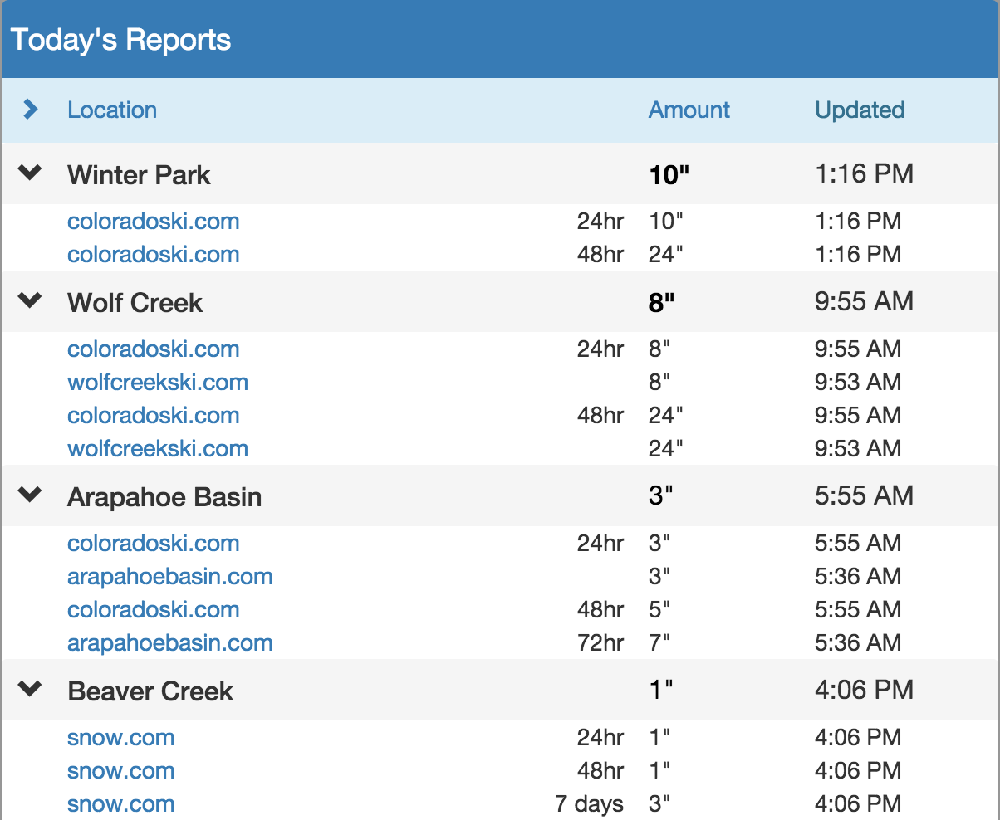

# goggles 
React frontend for the Colorado snow report website waapow.com.



## build
```npm install && grunt build```

## start against prod API
```NODE_ENV=production npm start```

## start against local API
requires local Tomcat running waapow WAR

```npm start```

## License
Unlicensed. Prohibited to use, copy, redistribute.
Contact the author if you are interested in doing something with the code.

## Revision History

### version 2
- Redux implementation. 
- ES6 with babel polyfill.
- Unit and integration tests using Karma/mocha.

### version 1
- React version. Previous (non-public) frontend was written in ExtJS.
- Removed unnecessary functionality, focusing on a fast, simple interface.
- Responsive design (with help from bootstrap).


